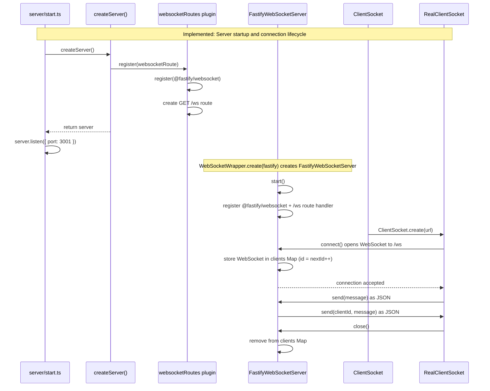
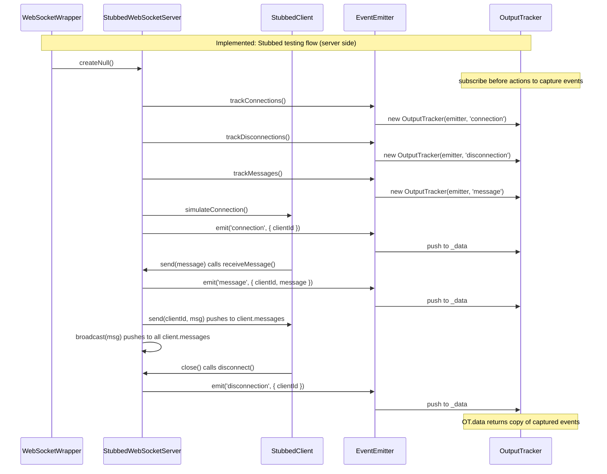
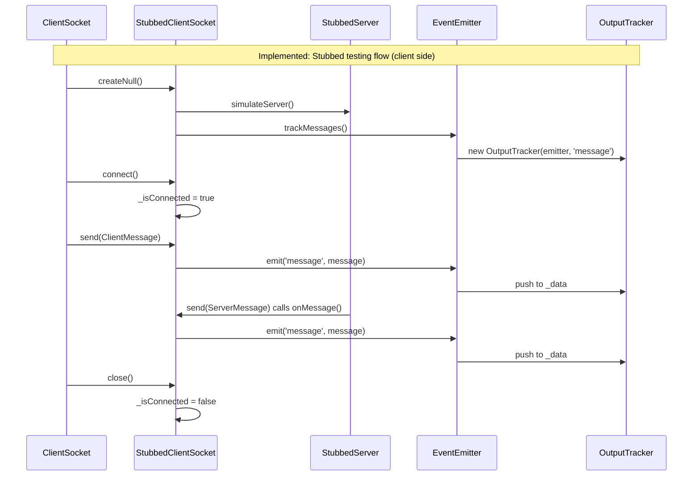
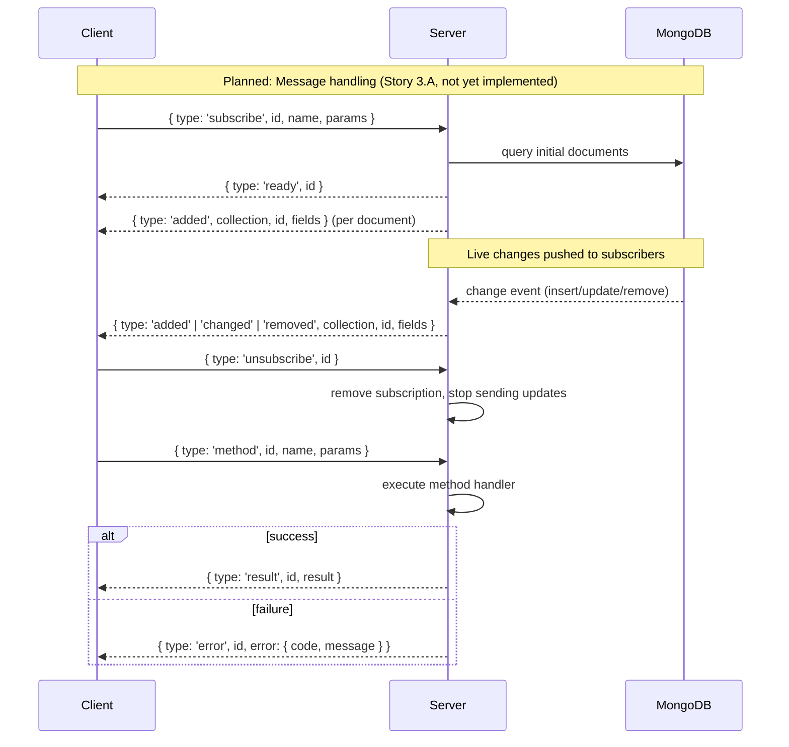

```mermaid
sequenceDiagram
    participant ST as server/start.ts
    participant CS as createServer()
    participant WP as websocketRoutes plugin
    participant FWS as FastifyWebSocketServer
    participant CL as ClientSocket
    participant RCS as RealClientSocket

    Note over ST,RCS: Implemented: Server startup and connection lifecycle

    ST->>CS: createServer()
    CS->>WP: register(websocketRoute)
    WP->>WP: register(@fastify/websocket)
    WP->>WP: create GET /ws route

    CS-->>ST: return server
    ST->>ST: server.listen({ port: 3001 })

    Note over FWS: WebSocketWrapper.create(fastify) creates FastifyWebSocketServer

    FWS->>FWS: start()
    FWS->>FWS: register @fastify/websocket + /ws route handler

    CL->>RCS: ClientSocket.create(url)
    RCS->>FWS: connect() opens WebSocket to /ws
    FWS->>FWS: store WebSocket in clients Map (id = nextId++)
    FWS-->>RCS: connection accepted

    RCS->>FWS: send(message) as JSON
    FWS->>RCS: send(clientId, message) as JSON

    RCS->>FWS: close()
    FWS->>FWS: remove from clients Map
```

---

```mermaid
sequenceDiagram
    participant WW as WebSocketWrapper
    participant SWS as StubbedWebSocketServer
    participant SC as StubbedClient
    participant EE as EventEmitter
    participant OT as OutputTracker

    Note over WW,OT: Implemented: Stubbed testing flow (server side)

    WW->>SWS: createNull()

    Note over OT: subscribe before actions to capture events

    SWS->>EE: trackConnections()
    EE->>OT: new OutputTracker(emitter, 'connection')

    SWS->>EE: trackDisconnections()
    EE->>OT: new OutputTracker(emitter, 'disconnection')

    SWS->>EE: trackMessages()
    EE->>OT: new OutputTracker(emitter, 'message')

    SWS->>SC: simulateConnection()
    SWS->>EE: emit('connection', { clientId })
    EE->>OT: push to _data

    SC->>SWS: send(message) calls receiveMessage()
    SWS->>EE: emit('message', { clientId, message })
    EE->>OT: push to _data

    SWS->>SC: send(clientId, msg) pushes to client.messages
    SWS->>SWS: broadcast(msg) pushes to all client.messages

    SC->>SWS: close() calls disconnect()
    SWS->>EE: emit('disconnection', { clientId })
    EE->>OT: push to _data

    Note over OT: OT.data returns copy of captured events
```

---

```mermaid
sequenceDiagram
    participant CS as ClientSocket
    participant SCS as StubbedClientSocket
    participant SS as StubbedServer
    participant EE as EventEmitter
    participant OT as OutputTracker

    Note over CS,OT: Implemented: Stubbed testing flow (client side)

    CS->>SCS: createNull()
    SCS->>SS: simulateServer()

    SCS->>EE: trackMessages()
    EE->>OT: new OutputTracker(emitter, 'message')

    CS->>SCS: connect()
    SCS->>SCS: _isConnected = true

    CS->>SCS: send(ClientMessage)
    SCS->>EE: emit('message', message)
    EE->>OT: push to _data

    SS->>SCS: send(ServerMessage) calls onMessage()
    SCS->>EE: emit('message', message)
    EE->>OT: push to _data

    CS->>SCS: close()
    SCS->>SCS: _isConnected = false
```

---

```mermaid
sequenceDiagram
    participant C as Client
    participant S as Server
    participant DB as MongoDB

    Note over C,DB: Planned: Message handling (Story 3.A, not yet implemented)

    C->>S: { type: 'subscribe', id, name, params }
    S->>DB: query initial documents
    S-->>C: { type: 'ready', id }
    S-->>C: { type: 'added', collection, id, fields } (per document)

    Note over S,DB: Live changes pushed to subscribers

    DB-->>S: change event (insert/update/remove)
    S-->>C: { type: 'added' | 'changed' | 'removed', collection, id, fields }

    C->>S: { type: 'unsubscribe', id }
    S->>S: remove subscription, stop sending updates

    C->>S: { type: 'method', id, name, params }
    S->>S: execute method handler

    alt success
        S-->>C: { type: 'result', id, result }
    else failure
        S-->>C: { type: 'error', id, error: { code, message } }
    end
```
