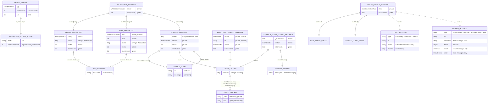

```mermaid
erDiagram
    FASTIFY_SERVER {
        FastifyInstance app
        fn createServer "server/index.ts"
        int port "3001"
    }

    WEBSOCKET_ROUTES_PLUGIN {
        string route "/ws"
        fn websocketRoute "registers fastify/websocket"
    }

    WEBSOCKET_WRAPPER {
        WebSocketInterface server "private"
        int clientCount "getter"
    }

    FASTIFY_WEBSOCKET {
        FastifyInstance fastify "private"
        Map clients "string to WebSocket"
        int nextId "private"
        int clientCount "getter"
    }

    REAL_WEBSOCKET {
        WebSocketServer wss "private, nullable"
        int port "private"
        Map clients "string to WebSocket"
        int nextId "private"
        int clientCount "getter"
    }

    STUBBED_WEBSOCKET {
        Map clients "string to StubbedClient"
        EventEmitter emitter "private"
        int nextId "private"
        int clientCount "getter"
    }

    STUBBED_CLIENT {
        string id "readonly"
        array messages "unknown[]"
    }

    CLIENT_SOCKET_WRAPPER {
        ClientSocketInterface client "private"
        bool isConnected "getter"
    }

    REAL_CLIENT_SOCKET_WRAPPER {
        WebSocket socket "private, nullable"
        string url "private, readonly"
        EventEmitter emitter "private"
        bool isConnected "getter"
    }

    STUBBED_CLIENT_SOCKET_WRAPPER {
        bool _isConnected "private"
        EventEmitter emitter "private"
        bool isConnected "getter"
    }

    STUBBED_SERVER {
        array messages "ServerMessage[]"
    }

    EVENT_EMITTER {
        Map handlers "string to handler[]"
    }

    OUTPUT_TRACKER {
        array _data "unknown[], private"
        array data "getter, returns copy"
    }

    CLIENT_MESSAGE {
        string type "subscribe | unsubscribe | method"
        string id
        string name "subscribe and method only"
        array params "method only"
    }

    SERVER_MESSAGE {
        string type "ready | added | changed | removed | result | error"
        string id
        string collection "data messages only"
        object fields "optional"
        unknown result "result messages only"
        EkoLiteError error "error messages only"
    }

    %% Server startup
    FASTIFY_SERVER ||--|| WEBSOCKET_ROUTES_PLUGIN : "registers plugin"

    %% WebSocketWrapper delegates to exactly one implementation
    WEBSOCKET_WRAPPER ||--o| FASTIFY_WEBSOCKET : "create(fastify)"
    WEBSOCKET_WRAPPER ||--o| REAL_WEBSOCKET : "createRawWs(port)"
    WEBSOCKET_WRAPPER ||--o| STUBBED_WEBSOCKET : "createNull()"

    %% Real implementations store raw WebSocket connections
    FASTIFY_WEBSOCKET ||--o{ WS_WEBSOCKET : "stores in clients Map"
    REAL_WEBSOCKET ||--o{ WS_WEBSOCKET : "stores in clients Map"

    %% Stubbed implementation uses StubbedClient
    STUBBED_WEBSOCKET ||--o{ STUBBED_CLIENT : "simulateConnection()"
    STUBBED_CLIENT }o--|| STUBBED_WEBSOCKET : "send() close()"

    %% Test observability (server side)
    STUBBED_WEBSOCKET ||--|| EVENT_EMITTER : "owns"
    EVENT_EMITTER ||--o{ OUTPUT_TRACKER : "trackConnections() trackDisconnections() trackMessages()"

    %% ClientSocket delegates to exactly one implementation
    CLIENT_SOCKET_WRAPPER ||--o| REAL_CLIENT_SOCKET : "create(url)"
    CLIENT_SOCKET_WRAPPER ||--o| STUBBED_CLIENT_SOCKET : "createNull()"

    %% Test observability (client side)
    REAL_CLIENT_SOCKET_WRAPPER ||--|| EVENT_EMITTER : "owns"
    STUBBED_CLIENT_SOCKET_WRAPPER ||--|| EVENT_EMITTER : "owns"
    STUBBED_CLIENT_SOCKET_WRAPPER ||--|| STUBBED_SERVER : "simulateServer()"

    %% Protocol messages flow over the websocket
    CLIENT_SOCKET_WRAPPER ||..|| CLIENT_MESSAGE : "sends"
    CLIENT_SOCKET_WRAPPER ||..|| SERVER_MESSAGE : "receives"

    WS_WEBSOCKET {
        string rawSocket "from ws library"
    }
```
