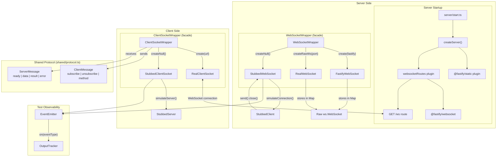

```mermaid
flowchart TD
    subgraph server ["Server Side"]
        direction TB

        subgraph startup ["Server Startup"]
            startTs["server/start.ts"] --> createServer["createServer()"]
            createServer --> fastifyStatic["@fastify/static plugin"]
            createServer --> wsPlugin["websocketRoutes plugin"]
            wsPlugin --> fastifyWs["@fastify/websocket"]
            wsPlugin --> wsRoute["GET /ws route"]
        end

        subgraph wrapper ["WebSocketWrapper (facade)"]
            wrapperClass["WebSocketWrapper"]
            wrapperClass -->|"create(fastify)"| fastifyImpl["FastifyWebSocket"]
            wrapperClass -->|"createRawWs(port)"| realImpl["RealWebSocket"]
            wrapperClass -->|"createNull()"| stubImpl["StubbedWebSocket"]
        end

        fastifyImpl -->|"stores in Map"| rawWs["Raw ws.WebSocket"]
        realImpl -->|"stores in Map"| rawWs

        stubImpl -->|"simulateConnection()"| stubClient["StubbedClient"]
        stubClient -->|"send() close()"| stubImpl
    end

    subgraph client ["Client Side"]
        direction TB

        subgraph clientWrapper ["ClientSocketWrapper (facade)"]
            clientClass["ClientSocketWrapper"]
            clientClass -->|"create(url)"| realClient["RealClientSocket"]
            clientClass -->|"createNull()"| stubClientSocket["StubbedClientSocket"]
        end

        stubClientSocket -->|"simulateServer()"| stubServer["StubbedServer"]
    end

    subgraph protocol ["Shared Protocol (shared/protocol.ts)"]
        direction LR
        clientMsg["ClientMessage\nsubscribe | unsubscribe | method"]
        serverMsg["ServerMessage\nready | data | result | error"]
    end

    subgraph testing ["Test Observability"]
        direction LR
        emitter["EventEmitter"]
        emitter -->|"on(eventType)"| tracker["OutputTracker"]
    end

    stubImpl --> emitter
    stubClientSocket --> emitter

    clientClass -->|"sends"| clientMsg
    clientClass -->|"receives"| serverMsg

    realClient <-->|"WebSocket connection"| wsRoute
```
