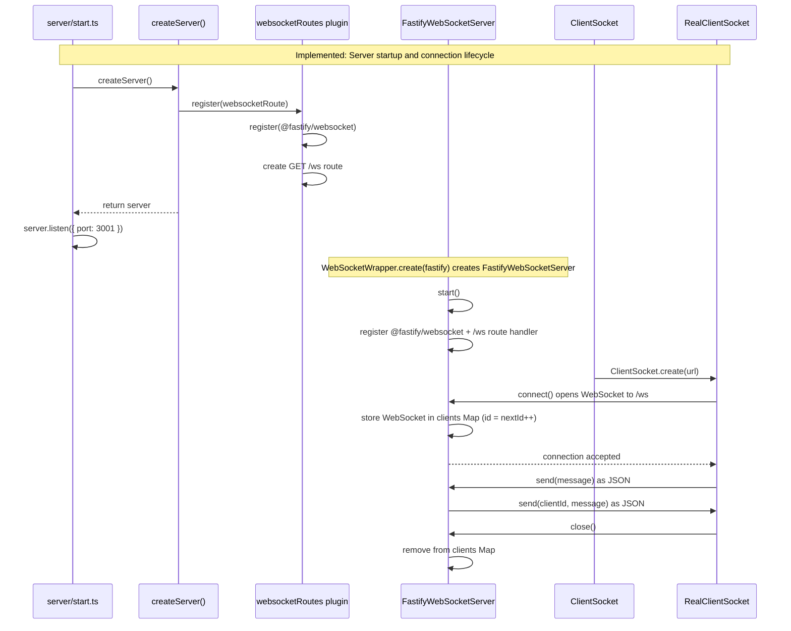

```mermaid
sequenceDiagram
    participant ST as server/start.ts
    participant CS as createServer()
    participant WP as websocketRoutes plugin
    participant FWS as FastifyWebSocketServer
    participant CL as ClientSocket
    participant RCS as RealClientSocket

    Note over ST,RCS: Implemented: Server startup and connection lifecycle

    ST->>CS: createServer()
    CS->>WP: register(websocketRoute)
    WP->>WP: register(@fastify/websocket)
    WP->>WP: create GET /ws route

    CS-->>ST: return server
    ST->>ST: server.listen({ port: 3001 })

    Note over FWS: WebSocketWrapper.create(fastify) creates FastifyWebSocketServer

    FWS->>FWS: start()
    FWS->>FWS: register @fastify/websocket + /ws route handler

    CL->>RCS: ClientSocket.create(url)
    RCS->>FWS: connect() opens WebSocket to /ws
    FWS->>FWS: store WebSocket in clients Map (id = nextId++)
    FWS-->>RCS: connection accepted

    RCS->>FWS: send(message) as JSON
    FWS->>RCS: send(clientId, message) as JSON

    RCS->>FWS: close()
    FWS->>FWS: remove from clients Map
```
