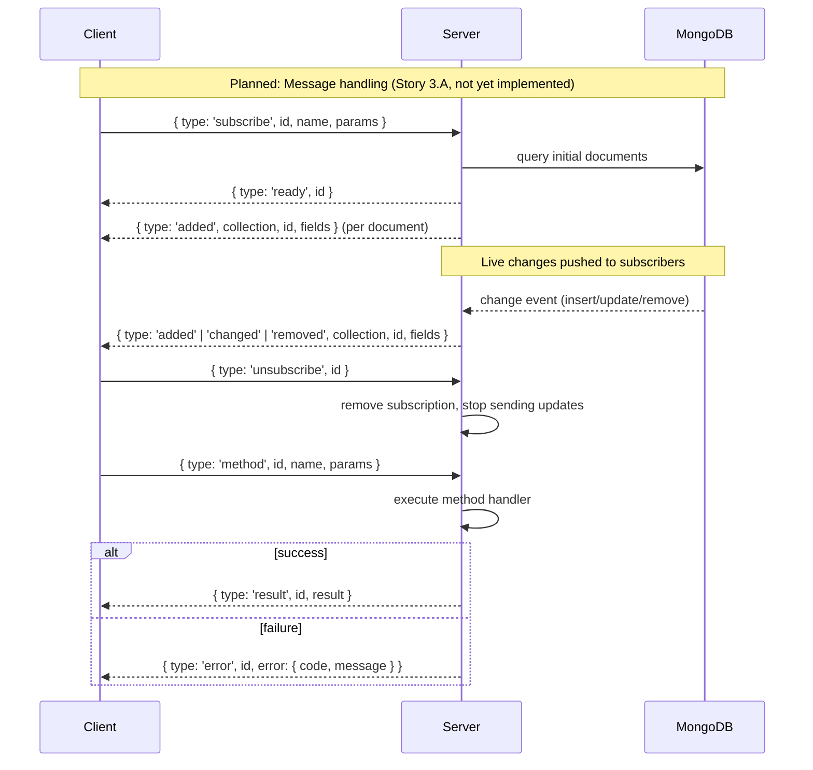

```mermaid
sequenceDiagram
    participant C as Client
    participant S as Server
    participant DB as MongoDB

    Note over C,DB: Planned: Message handling (Story 3.A, not yet implemented)

    C->>S: { type: 'subscribe', id, name, params }
    S->>DB: query initial documents
    S-->>C: { type: 'ready', id }
    S-->>C: { type: 'added', collection, id, fields } (per document)

    Note over S,DB: Live changes pushed to subscribers

    DB-->>S: change event (insert/update/remove)
    S-->>C: { type: 'added' | 'changed' | 'removed', collection, id, fields }

    C->>S: { type: 'unsubscribe', id }
    S->>S: remove subscription, stop sending updates

    C->>S: { type: 'method', id, name, params }
    S->>S: execute method handler

    alt success
        S-->>C: { type: 'result', id, result }
    else failure
        S-->>C: { type: 'error', id, error: { code, message } }
    end
```
