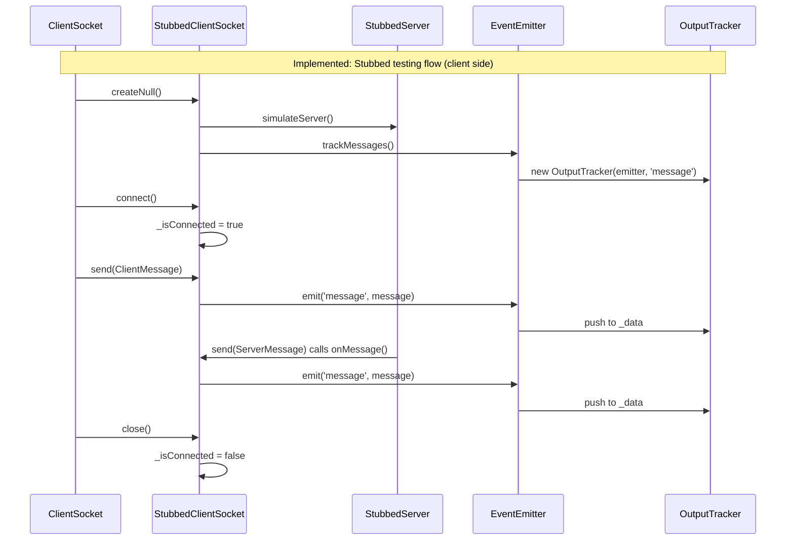

```mermaid
sequenceDiagram
    participant CS as ClientSocket
    participant SCS as StubbedClientSocket
    participant SS as StubbedServer
    participant EE as EventEmitter
    participant OT as OutputTracker

    Note over CS,OT: Implemented: Stubbed testing flow (client side)

    CS->>SCS: createNull()
    SCS->>SS: simulateServer()

    SCS->>EE: trackMessages()
    EE->>OT: new OutputTracker(emitter, 'message')

    CS->>SCS: connect()
    SCS->>SCS: _isConnected = true

    CS->>SCS: send(ClientMessage)
    SCS->>EE: emit('message', message)
    EE->>OT: push to _data

    SS->>SCS: send(ServerMessage) calls onMessage()
    SCS->>EE: emit('message', message)
    EE->>OT: push to _data

    CS->>SCS: close()
    SCS->>SCS: _isConnected = false
```
