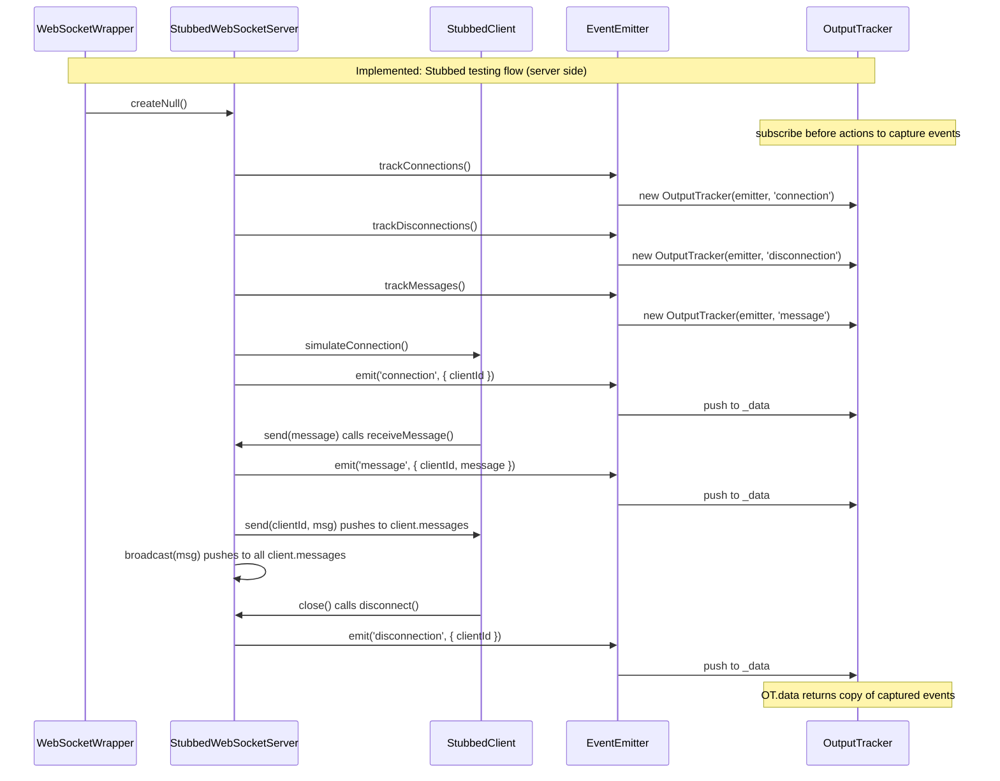

```mermaid
sequenceDiagram
    participant WW as WebSocketWrapper
    participant SWS as StubbedWebSocketServer
    participant SC as StubbedClient
    participant EE as EventEmitter
    participant OT as OutputTracker

    Note over WW,OT: Implemented: Stubbed testing flow (server side)

    WW->>SWS: createNull()

    Note over OT: subscribe before actions to capture events

    SWS->>EE: trackConnections()
    EE->>OT: new OutputTracker(emitter, 'connection')

    SWS->>EE: trackDisconnections()
    EE->>OT: new OutputTracker(emitter, 'disconnection')

    SWS->>EE: trackMessages()
    EE->>OT: new OutputTracker(emitter, 'message')

    SWS->>SC: simulateConnection()
    SWS->>EE: emit('connection', { clientId })
    EE->>OT: push to _data

    SC->>SWS: send(message) calls receiveMessage()
    SWS->>EE: emit('message', { clientId, message })
    EE->>OT: push to _data

    SWS->>SC: send(clientId, msg) pushes to client.messages
    SWS->>SWS: broadcast(msg) pushes to all client.messages

    SC->>SWS: close() calls disconnect()
    SWS->>EE: emit('disconnection', { clientId })
    EE->>OT: push to _data

    Note over OT: OT.data returns copy of captured events
```
