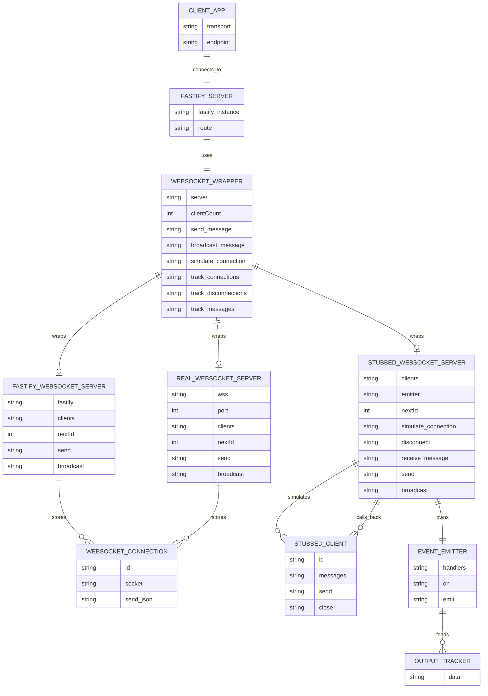

```mermaid
erDiagram
    CLIENT_APP {
        string transport
        string endpoint
    }

    FASTIFY_SERVER {
        string fastify_instance
        string route
    }

    WEBSOCKET_WRAPPER {
        string server
        int clientCount
        string send_message
        string broadcast_message
        string simulate_connection
        string track_connections
        string track_disconnections
        string track_messages
    }

    FASTIFY_WEBSOCKET_SERVER {
        string fastify
        string clients
        int nextId
        string send
        string broadcast
    }

    REAL_WEBSOCKET_SERVER {
        string wss
        int port
        string clients
        int nextId
        string send
        string broadcast
    }

    STUBBED_WEBSOCKET_SERVER {
        string clients
        string emitter
        int nextId
        string simulate_connection
        string disconnect
        string receive_message
        string send
        string broadcast
    }

    WEBSOCKET_CONNECTION {
        string id
        string socket
        string send_json
    }

    STUBBED_CLIENT {
        string id
        string messages
        string send
        string close
    }

    EVENT_EMITTER {
        string handlers
        string on
        string emit
    }

    OUTPUT_TRACKER {
        string data
    }

    CLIENT_APP ||--|| FASTIFY_SERVER : connects_to
    FASTIFY_SERVER ||--|| WEBSOCKET_WRAPPER : uses

    WEBSOCKET_WRAPPER ||--o| FASTIFY_WEBSOCKET_SERVER : wraps
    WEBSOCKET_WRAPPER ||--o| REAL_WEBSOCKET_SERVER : wraps
    WEBSOCKET_WRAPPER ||--o| STUBBED_WEBSOCKET_SERVER : wraps

    FASTIFY_WEBSOCKET_SERVER ||--o{ WEBSOCKET_CONNECTION : stores
    REAL_WEBSOCKET_SERVER ||--o{ WEBSOCKET_CONNECTION : stores

    STUBBED_WEBSOCKET_SERVER ||--o{ STUBBED_CLIENT : simulates
    STUBBED_CLIENT }o--|| STUBBED_WEBSOCKET_SERVER : calls_back

    STUBBED_WEBSOCKET_SERVER ||--|| EVENT_EMITTER : owns
    EVENT_EMITTER ||--o{ OUTPUT_TRACKER : feeds
```
