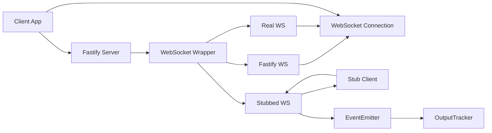

```mermaid
flowchart LR
    client["Client App"] --> fastify["Fastify Server"]
    fastify --> wrapper["WebSocket Wrapper"]

    wrapper --> fastifyWs["Fastify WS"]
    wrapper --> realWs["Real WS"]
    wrapper --> stubWs["Stubbed WS"]

    fastifyWs --> wsConn["WebSocket Connection"]
    realWs --> wsConn

    client --> wsConn

    stubWs --> stubClient["Stub Client"]
    stubClient --> stubWs

    stubWs --> emitter["EventEmitter"]
    emitter --> tracker["OutputTracker"]
```
