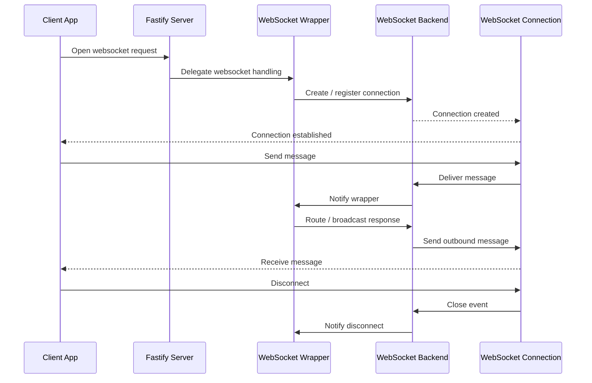

```mermaid
sequenceDiagram
    participant C as Client App
    participant F as Fastify Server
    participant W as WebSocket Wrapper
    participant S as WebSocket Backend
    participant X as WebSocket Connection

    C->>F: Open websocket request
    F->>W: Delegate websocket handling
    W->>S: Create / register connection
    S-->>X: Connection created
    X-->>C: Connection established

    C->>X: Send message
    X->>S: Deliver message
    S->>W: Notify wrapper
    W->>S: Route / broadcast response
    S->>X: Send outbound message
    X-->>C: Receive message

    C->>X: Disconnect
    X->>S: Close event
    S->>W: Notify disconnect
```
